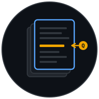

<div align="center">
  

  <h1>DocuChat RAG</h1>

  <p><strong>Production grade local RAG. Tested. Evaluated. CI protected.</strong></p>

  <p>
    
    
    
    
    
  </p>
</div>

---

## What is this

Upload a PDF or text file. Ask questions in plain English. Get answers from inside the document.

Runs 100% on your machine. No API keys. No subscriptions. Works offline once set up.

**Example.** Upload a 50 page employee handbook. Ask "what is the vacation policy". Get the answer in seconds.

## Why this exists

Most RAG demos are toys. They show one query, then break the moment you add real documents or real users.

DocuChat is built like a product, not a demo. It ships with a real test suite, a CI pipeline, an evaluation framework, and structured docs for stakeholders. You can fork it and put it in front of a real team.

If you need a smaller version that runs on Azure free tier, see [RAGChatBotLite](https://github.com/MErblin/RAGChatBotLite).

## Features

- 📄 **Multi document upload** — PDF and TXT
- 💬 **Natural language Q&A** — plain English in, sourced answers out
- 🔍 **Semantic search** — vector embeddings via ChromaDB
- 🤖 **Local LLM** — Ollama, no API keys
- 🚀 **Modern stack** — FastAPI backend, Streamlit frontend
- ✅ **Real tests** — pytest unit + integration suites
- 🧪 **Evaluation framework** — regression checks with profile thresholds
- 🔁 **CI ready** — lint, test, regression on every push
- 📊 **Audit logging** — request correlation and structured logs

## Architecture

```
┌─────────────────┐     ┌─────────────────┐     ┌─────────────────┐
│   Streamlit UI  │────▶│  FastAPI API    │────▶│   LlamaIndex    │
│   (Frontend)    │     │   (Backend)     │     │   (RAG Core)    │
└─────────────────┘     └─────────────────┘     └────────┬────────┘
                                                         │
                        ┌────────────────────────────────┼────────────────────┐
                        │                                │                    │
                        ▼                                ▼                    ▼
                ┌───────────────┐              ┌─────────────────┐   ┌───────────────┐
                │   ChromaDB    │              │   HuggingFace   │   │    Ollama     │
                │ (Vector Store)│              │  (Embeddings)   │   │    (LLM)      │
                └───────────────┘              └─────────────────┘   └───────────────┘
```

## Tech stack

| Component | Technology |
|---|---|
| RAG framework | LlamaIndex |
| Backend | FastAPI |
| Frontend | Streamlit |
| Vector database | ChromaDB |
| Embeddings | HuggingFace (all-MiniLM-L6-v2) |
| LLM | Ollama (Llama 3.2 default) |
| Testing | pytest with coverage |

## Quick start

### Prerequisites

- Python 3.10+
- Ollama from https://ollama.ai

### 1. Clone

```bash
git clone https://github.com/MErblin/docuchat-rag.git
cd docuchat-rag
```

### 2. Set up environment

```bash
python -m venv .venv

# Windows
.venv\Scripts\activate
# macOS / Linux
source .venv/bin/activate

pip install -e ".[dev]"
```

### 3. Configure

```bash
cp .env.example .env
# edit .env if you need to change defaults
```

### 4. Install Ollama model

```bash
ollama pull llama3.2
```

### 5. Run

Open three terminals.

**Terminal 1 — Ollama**
```bash
ollama serve
```

**Terminal 2 — FastAPI backend**
```bash
uvicorn app.main:app --reload --port 8000
```

**Terminal 3 — Streamlit frontend**
```bash
streamlit run ui/app.py --server.port 8501
```

### 6. Open the app

http://localhost:8501

## API documentation

When the backend is running:

- **Swagger UI** — http://localhost:8000/docs
- **ReDoc** — http://localhost:8000/redoc

### Endpoints

| Method | Endpoint | Description |
|---|---|---|
| GET | `/api/health` | Health check |
| POST | `/api/upload` | Upload a document |
| POST | `/api/query` | Query documents |

## Testing

```bash
# All tests
pytest -v

# With coverage report
pytest --cov=app --cov-report=html

# Unit only
pytest tests/unit -v

# Integration only
pytest tests/integration -v
```

### Regression checks

```bash
# Contract regression (free, CI friendly, no model needed)
python scripts/run_regression.py --mode mock

# Live regression with profile thresholds
python scripts/run_regression.py --mode live
```

## Project structure

```
docuchat-rag/
├── app/                    # FastAPI backend
│   ├── api/
│   │   └── routes.py
│   ├── services/
│   │   ├── ingestion.py
│   │   └── rag.py
│   ├── config.py
│   └── main.py
├── ui/
│   └── app.py              # Streamlit frontend
├── tests/
│   ├── unit/
│   └── integration/
├── scripts/
│   └── run_regression.py
├── data/
│   └── chroma/             # Vector store
├── docs/                   # Stakeholder docs and playbooks
├── pyproject.toml
└── README.md
```

## Roadmap

- [x] Sprint 1 — Project foundation
- [ ] Sprint 2 — Document ingestion pipeline
- [ ] Sprint 3 — RAG query engine
- [ ] Sprint 4 — Complete API
- [ ] Sprint 5 — UI polish and MVP release

### Future

- 📎 Source citations with document excerpts
- 📁 Multi document management UI
- 💬 Conversation memory
- 🔐 User authentication
- ☁️ Cloud deployment guide

## Stakeholder docs

For non technical messaging, see `docs/BUSINESS_EXPLANATION_PLAYBOOK.md`.

## Contributing

1. Fork
2. Create a feature branch (`git checkout -b feat/amazing-feature`)
3. Commit (`git commit -m 'feat: add amazing feature'`)
4. Push (`git push origin feat/amazing-feature`)
5. Open a PR

## Sibling project

For a zero cost Azure deployable version with a simpler stack, see [RAGChatBotLite](https://github.com/MErblin/RAGChatBotLite).

## License

MIT — see [LICENSE](LICENSE).
